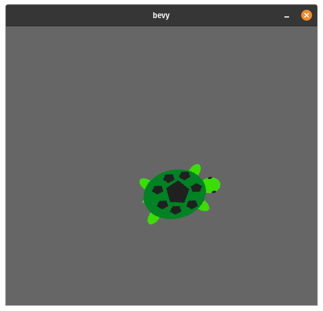

## turtlesim
### It's Turtles(im) All The Way Down!™
---
### Move a turtle around on screen with unstable software, but in Rust!

Ever wanted make an [animated turtle](https://docs.ros.org/en/rolling/Tutorials/Turtlesim/Introducing-Turtlesim.html) move around on screen? Now you can!

Ever want to throw your computer off a tall building while trying to "configure" your ROS environment, or wonder why the heck ROS package versions are tied to your operating system? Now you don't have to worry about it! (Worry about the number of pre-1.0 software packages that are being here instead!) 

Ever wonder "why would I want to use [rqt](http://wiki.ros.org/rqt) or [Gazebo](http://www.gazebosim.org/tutorials?tut=guided_b1&cat=) instead of, like, a normal [game engine](https://resources.unity.com/unitenow/onlinesessions/simulating-robots-with-ros-and-unity) running with high-fidelity physics or something?" Now you can easily integrate your autonomy code with [Bevy](https://github.com/bevyengine/bevy)'s ECS system to take advantage of the entire ecosystem!

<center></center>

### Development

For [faster compile times](https://bevyengine.org/learn/book/getting-started/setup/#enable-fast-compiles-optional), consider using the Bevy dynamic linking feature through
```sh
$ cargo run --bin turtlesim --features bevy/dynamic
```
or by changing the `Cargo.toml` file to include `bevy = {version = "0.6", features = ["dynamic"]}`.

### Additional Resources

Also, check out the following:
- [`turtle`](https://github.com/sunjay/turtle): Another way to move a turtle-y thing around
- [rust-mq](https://github.com/gridgentoo/rust-mq): A ZeroMQ client library written in Rust
- [MOOS-IvP](https://oceanai.mit.edu/moos-ivp/pmwiki/pmwiki.php?n=Main.HomePage): Marine robotics-focused middleware
- [MQTT](https://mqtt.org/): "OASIS standard messaging protocol for the Internet of Things"
- [ROS2](https://docs.ros.org/en/rolling/)

